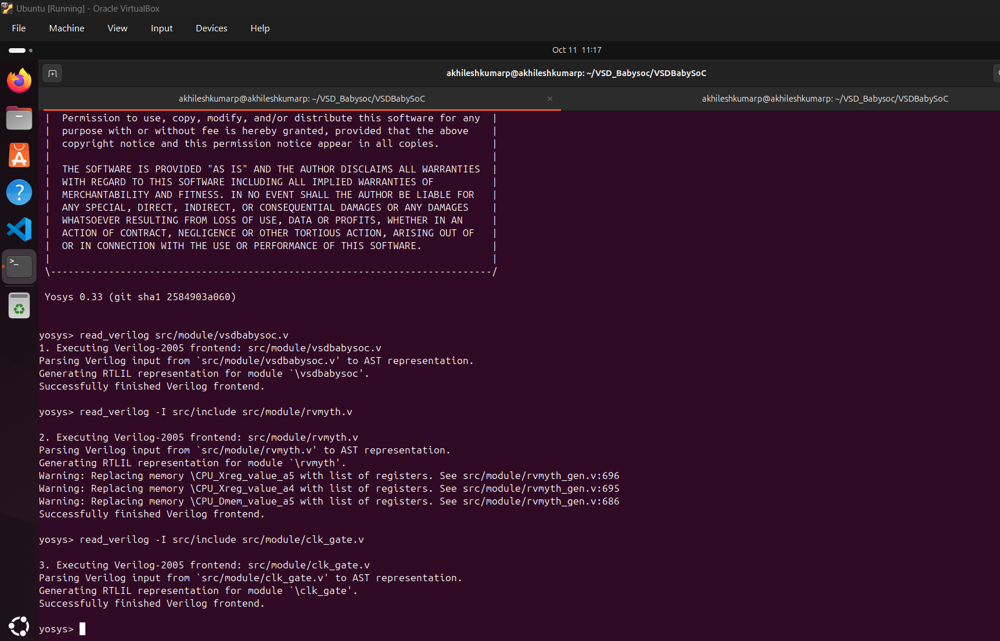

# GLS OF BABYSOC
## POST-SYNTHESIS SIMULATION

### Purpose of GLS:
Gate-Level Simulation is used to verify the functionality of a design after the synthesis process. Unlike behavioral or RTL (Register Transfer Level) simulations, which are performed at a higher level of abstraction, GLS works on the netlist generated post-synthesis. This netlist includes the actual gates and connections used to implement the design.

### Key Aspects of GLS for BabySoC:
1. **Verification with Timing Information:**
   - GLS is performed using Standard Delay Format (SDF) files to ensure timing correctness.
   - This checks if the SoC behaves as expected under real-world timing constraints.

2. **Design Validation Post-Synthesis:**
   - Confirms that the design's logical behavior remains correct after mapping it to the gate-level representation.
   - Ensures that the design is free from issues like metastability or glitches.

3. **Simulation Tools:**
   - Tools like Icarus Verilog or a similar simulator can be used for compiling and running the gate-level netlist.
   - Waveforms are typically analyzed using GTKWave.

4. **Importance for BabySoC:**
   - BabySoC consists of multiple modules like the RISC-V processor, PLL, and DAC. GLS ensures that these modules interact correctly and meet the timing requirements in the synthesized design.


Here is the step-by-step execution plan for running the  commands manually:
---
### **Step 1: Load the Top-Level Design and Supporting Modules**
```bash
yosys
```

Inside the Yosys shell, run:
```yosys
read_verilog src/module/vsdbabysoc.v
read_verilog -I src/include src/module/rvmyth.v
read_verilog -I src/include src/module/clk_gate.v

```
Read verilog files


---

### **Step 2: Load the Liberty Files for Synthesis**
Inside the same Yosys shell, run:
```yosys
read_liberty -lib src/lib/avsdpll.lib
read_liberty -lib src/lib/avsddac.lib
read_liberty -lib src/lib/sky130_fd_sc_hd__tt_025C_1v80.lib
```
Read liberty files from lib.


---

### **Step 3: Run Synthesis Targeting `vsdbabysoc`**
```yosys
synth -top vsdbabysoc
```
Yosys Synthesis and terminal results: 


```bash
7.25. Printing statistics.

=== clk_gate ===

   Number of wires:                  5
   Number of wire bits:              5
   Number of public wires:           5
   Number of public wire bits:       5
   Number of memories:               0
   Number of memory bits:            0
   Number of processes:              0
   Number of cells:                  0

=== rvmyth ===

   Number of wires:               3948
   Number of wire bits:           6635
   Number of public wires:         269
   Number of public wire bits:    2941
   Number of memories:               0
   Number of memory bits:            0
   Number of processes:              0
   Number of cells:               5165
     $_ANDNOT_                    1412
     $_AND_                        174
     $_DFF_P_                      239
     $_MUX_                        513
     $_NAND_                        42
     $_NOR_                         99
     $_NOT_                         49
     $_ORNOT_                       74
     $_OR_                        1322
     $_SDFFE_PP0P_                 962
     $_SDFFE_PP1P_                  64
     $_SDFF_PP0_                     8
     $_XNOR_                        71
     $_XOR_                        129
     clk_gate                        7

=== vsdbabysoc ===

   Number of wires:                  9
   Number of wire bits:             18
   Number of public wires:           9
   Number of public wire bits:      18
   Number of memories:               0
   Number of memory bits:            0
   Number of processes:              0
   Number of cells:                  3
     avsddac                         1
     avsdpll                         1
     rvmyth                          1

=== design hierarchy ===

   vsdbabysoc                        1
     rvmyth                          1
       clk_gate                      7

   Number of wires:               3992
   Number of wire bits:           6688
   Number of public wires:         313
   Number of public wire bits:    2994
   Number of memories:               0
   Number of memory bits:            0
   Number of processes:              0
   Number of cells:               5160
     $_ANDNOT_                    1412
     $_AND_                        174
     $_DFF_P_                      239
     $_MUX_                        513
     $_NAND_                        42
     $_NOR_                         99
     $_NOT_                         49
     $_ORNOT_                       74
     $_OR_                        1322
     $_SDFFE_PP0P_                 962
     $_SDFFE_PP1P_                  64
     $_SDFF_PP0_                     8
     $_XNOR_                        71
     $_XOR_                        129
     avsddac                         1
     avsdpll                         1
```

---

### **Step 4: Map D Flip-Flops to Standard Cells**
```yosys
dfflibmap -liberty src/lib/sky130_fd_sc_hd__tt_025C_1v80.lib
```

Map dff to standard cell run terminal


---

### **Step 5: Perform Optimization and Technology Mapping**
```yosys
opt
abc -liberty src/lib/sky130_fd_sc_hd__tt_025C_1v80.lib -script +strash;scorr;ifraig;retime;{D};strash;dch,-f;map,-M,1,{D}
```

opt output 


abc output


---

### **Step 6: Perform Final Clean-Up and Renaming**
```yosys
flatten
setundef -zero
clean -purge
rename -enumerate
```


---

### **Step 7: Check Statistics**
```yosys
stat
```


---

### **Step 8: Write the Synthesized Netlist**
```yosys
write_verilog -noattr output/post_synth_sim/vsdbabysoc.synth.v
```

---

## POST_SYNTHESIS SIMULATION AND WAVEFORMS
---

### **Step 1: Compile the Testbench**
Run the following `iverilog` command to compile the testbench:
```bash
iverilog -o output/post_synth_sim/post_synth_sim.out -DPOST_SYNTH_SIM -DFUNCTIONAL -DUNIT_DELAY=#1 -I src/include -I src/module src/module/testbench.v
```
---
### **Step 2: Navigate to the Post-Synthesis Simulation Output Directory**
```bash
cd output/post_synth_sim/
```
---
### **Step 3: Run the Simulation**

```bash
./post_synth_sim.out
```
---
### **Step 4: View the Waveforms in GTKWave**

```bash
gtkwave post_synth_sim.vcd
```
---

