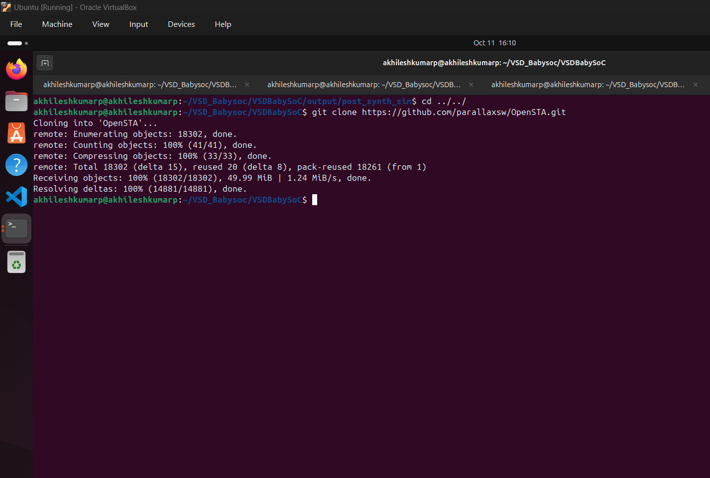
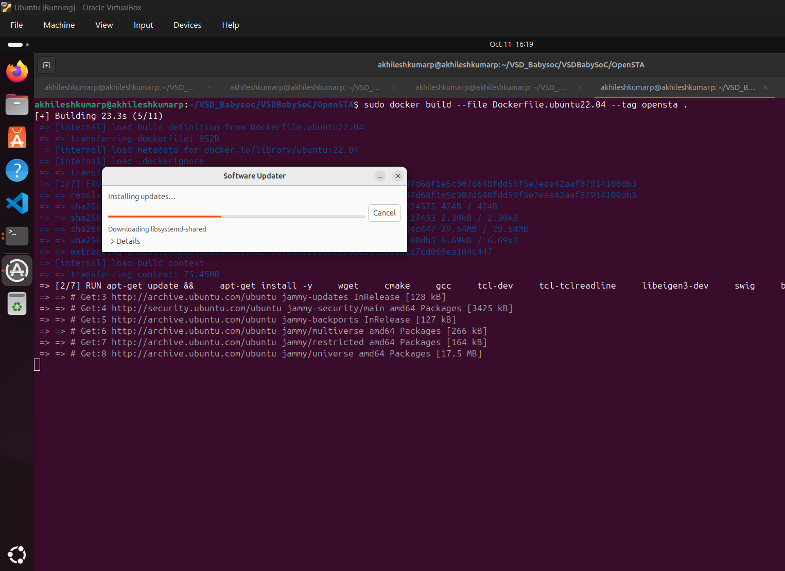
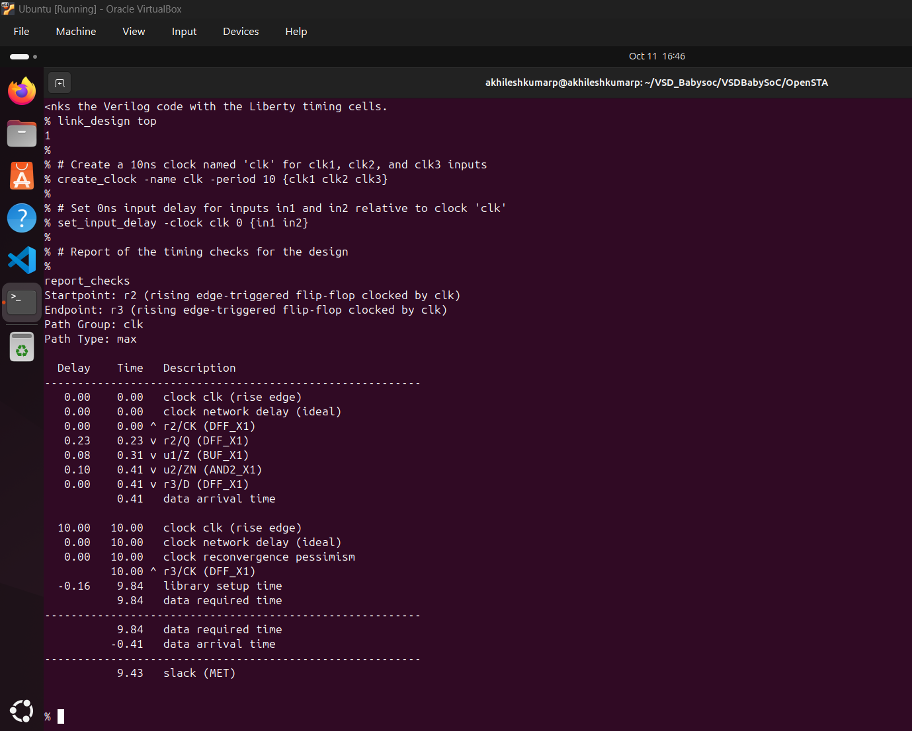
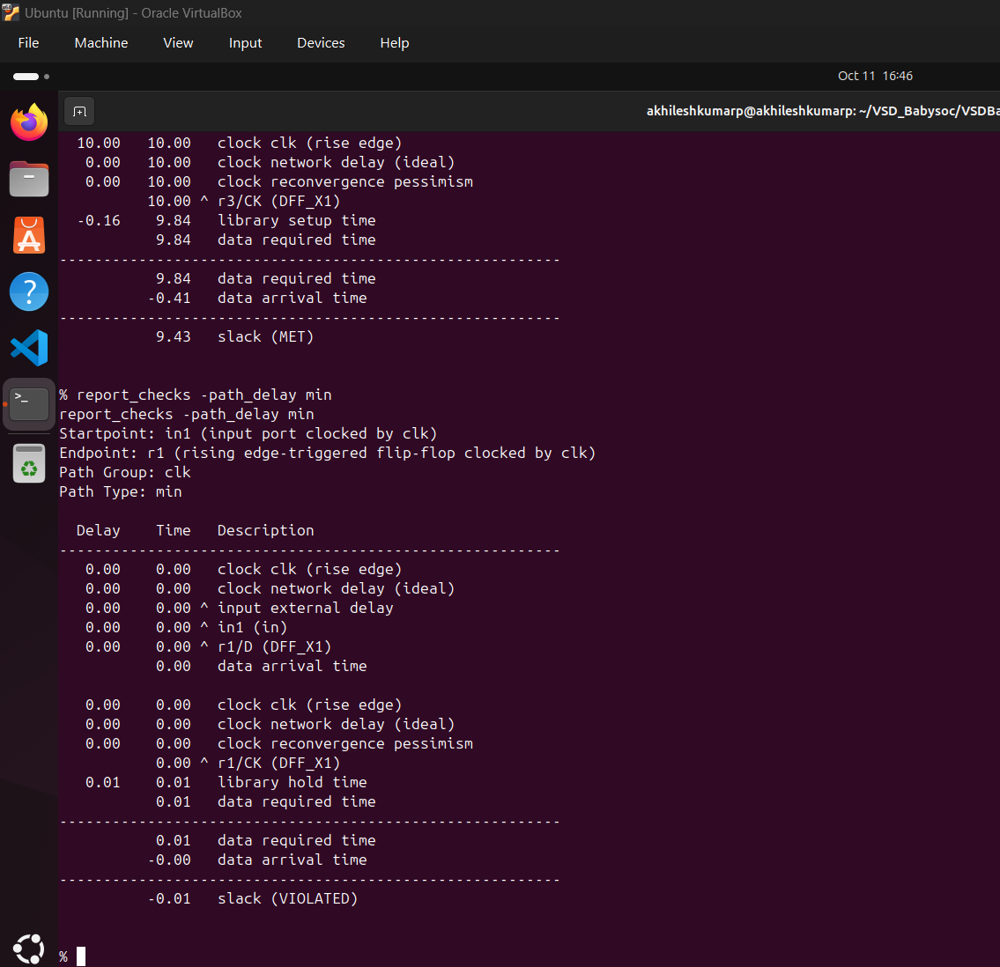

# Timing Graphs using openSTA
## Introduction
Static Timing Analysis is one of the many techniques available to verify the timing of a digital design.

An alternate approach used to verify the timing is the timing simulation which can verify the functionality as well as the timing of the design.

The term timing analysis is used to refer to either of these two methods - static timing analysis, or the timing simulation.

Thus, timing analysis simply refers to the analysis of the design for timing issues.

The STA is static since the analysis of the design is carried out statically and does not depend upon the data values being applied at the input pins.

This is in contrast to simulation based timing analysis where a stimulus is applied on input signals, resulting behavior is observed and verified, then time is advanced with new input stimulus applied, and the new behavior is observed and verified and so on.

# Installation of OpenSTA
1.clone repository
```
    git clone https://github.com/parallaxsw/OpenSTA.git
    cd OpenSTA
```


NOTE: 
if no docker found in the below command then do the following : 

Update your package list
sudo apt update


Install required packages
sudo apt install ca-certificates curl gnupg


Add Docker’s official GPG key
sudo install -m 0755 -d /etc/apt/keyrings
curl -fsSL https://download.docker.com/linux/ubuntu/gpg | \
  sudo gpg --dearmor -o /etc/apt/keyrings/docker.gpg


Set up the Docker repository
echo \
  "deb [arch=$(dpkg --print-architecture) \
  signed-by=/etc/apt/keyrings/docker.gpg] \
  https://download.docker.com/linux/ubuntu \
  $(lsb_release -cs) stable" | \
  sudo tee /etc/apt/sources.list.d/docker.list > /dev/null


Update again and install Docker
sudo apt update
sudo apt install docker-ce docker-ce-cli containerd.io docker-buildx-plugin docker-compose-plugin

this sould take sometime.


Verify Docker is working
sudo docker --version


You should see something like:
Docker version 24.x.x, build xxxx


2.Build the Docker Image
```
sudo docker build --file Dockerfile.ubuntu22.04 --tag opensta .
```

this should take sometime.

3.Run the docker image
```
sudo docker run -i -v $HOME:/data opensta
```
# Timing Analysis Using Inline Commands
Once inside the OpenSTA shell (% prompt), you can perform a basic static timing analysis using the following inline commands:

```
# Instructs OpenSTA to read and load the Liberty file "nangate45_slow.lib.gz".
read_liberty /OpenSTA/examples/nangate45_slow.lib.gz

# Intructs OpenSTA to read and load the Verilog file (gate level verilog netlist) "example1.v"
read_verilog /OpenSTA/examples/example1.v

# Using "top," which stands for the main module, links the Verilog code with the Liberty timing cells.
link_design top

# Create a 10ns clock named 'clk' for clk1, clk2, and clk3 inputs 
create_clock -name clk -period 10 {clk1 clk2 clk3}

# Set 0ns input delay for inputs in1 and in2 relative to clock 'clk'
set_input_delay -clock clk 0 {in1 in2}

# Report of the timing checks for the design 
report_checks
```



This represents a setup (max delay) corner, so the analysis focuses on setup timing by default.

How to Also Get Hold (min) Paths:

If you want both setup and hold timing checks (i.e., both max and min path delays), use:
```
report_checks -path_delay min
```



### Timing Analysis Using a TCL Script

set list_of_lib_files(1) "sky130_fd_sc_hd__tt_025C_1v80.lib"
set list_of_lib_files(2) "sky130_fd_sc_hd__ff_100C_1v65.lib"
set list_of_lib_files(3) "sky130_fd_sc_hd__ff_100C_1v95.lib"
set list_of_lib_files(4) "sky130_fd_sc_hd__ff_n40C_1v56.lib"
set list_of_lib_files(5) "sky130_fd_sc_hd__ff_n40C_1v65.lib"
set list_of_lib_files(6) "sky130_fd_sc_hd__ff_n40C_1v76.lib"
set list_of_lib_files(7) "sky130_fd_sc_hd__ss_100C_1v40.lib"
set list_of_lib_files(8) "sky130_fd_sc_hd__ss_100C_1v60.lib"
set list_of_lib_files(9) "sky130_fd_sc_hd__ss_n40C_1v28.lib"
set list_of_lib_files(10) "sky130_fd_sc_hd__ss_n40C_1v35.lib"
set list_of_lib_files(11) "sky130_fd_sc_hd__ss_n40C_1v40.lib"
set list_of_lib_files(12) "sky130_fd_sc_hd__ss_n40C_1v44.lib"
set list_of_lib_files(13) "sky130_fd_sc_hd__ss_n40C_1v76.lib"

for {set i 1} {$i <= [array size list_of_lib_files]} {incr i} {
read_liberty ./timing_libs/$list_of_lib_files($i)
read_verilog ./vsdbabysoc.synth.v
link_design vsdbabysoc
current_design
read_sdc vsdbabysoc_synthesis.sdc
check_setup -verbose
report_checks -path_delay min_max -fields {nets cap slew input_pins fanout} -digits {4} > ./sta_output/min_max_$list_of_lib_files($i).txt

exec echo "$list_of_lib_files($i)" >> ./sta_output/sta_worst_max_slack.txt
report_worst_slack -max -digits {4} >> ./sta_output/sta_worst_max_slack.txt

exec echo "$list_of_lib_files($i)" >> ./sta_output/sta_worst_min_slack.txt
report_worst_slack -min -digits {4} >> ./sta_output/sta_worst_min_slack.txt

exec echo "$list_of_lib_files($i)" >> ./sta_output/sta_tns.txt
report_tns -digits {4} >> ./sta_output/sta_tns.txt

exec echo "$list_of_lib_files($i)" >> ./sta_output/sta_wns.txt
report_wns -digits {4} >> ./sta_output/sta_wns.txt
}